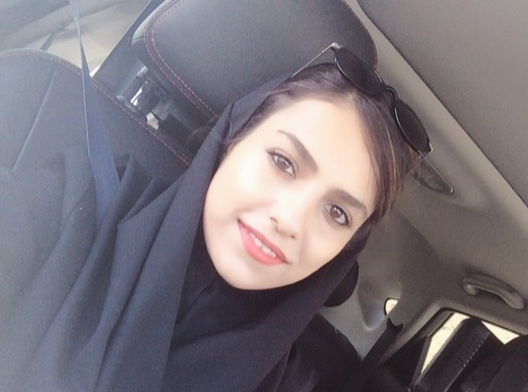

<html lang="en">

<head>
    <meta charset="utf-8">
    <meta name="viewport" content="width=device-width, initial-scale=1.0">
    <meta http-equiv="X-UA-compatible" content="ie=edge">
    <link rel="stylesheet" href="css/animate.css">
    <link rel="stylesheet" href="css/style.css">
    <title>nadia mohebbi</title>
</head>

<body>
    
    

        <header>
            

                <h1>Nadia</h1>
            

            <nav>
                <ul>
                    <li>
                        <a href="about">about me</a>
                    </li>
                    <li>
                        <a href="skills">skills</a>
                    </li>
                    <li>
                        <a href="https://quera.ir/profile/nadiamohebbi77">Quera</a>
                    </li>
                    <li>
                        <a href="https://nadiam77.github.io/mohebbi.github.io/index-fa.html">فارسی</a>  
                    </li>
                </ul>
            </nav>
        </header>
    

     
     
    

        

                <h1>Hi</h1>
                <h1>I'm Nadia Mohebbi</h1>
                <h1>Computer Engineering Software</h1>
        

    

     
     
    

        <h1>About</h1>
        

            
I do the work I do because I love it. I like the industry. I like the people I meet. I like to talk shop. I embrace the tecology. I like to make the world a better place.I like computers very much. Hopefully we cross paths in the real world someday and we can make it
                a better place together and Let's raise the field of technology day by day.

            
I do the work I do because I love it. I like the industry. I like the people I meet. I like to talk shop. I embrace the tecology. I like to make the world a better place.I like computers very much. Hopefully we cross paths in the real world someday and we can make it
                a better place together and Let's raise the field of technology day by day.

            
